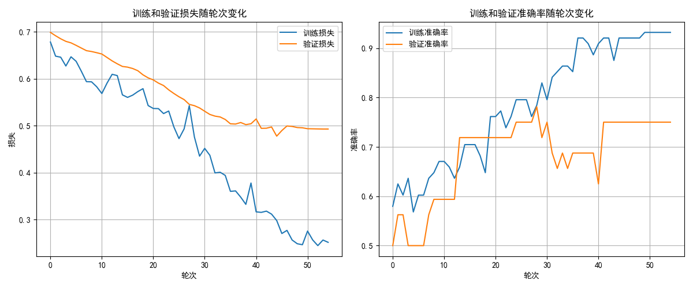

# 学pytorch做的一个简单的小例子

> data目录下的train和val下面的2个目录分别保存着训练和验证时用的猫和狗的图片
> 
> best_model.pth是训练中保存最好的模型

## 安装

```shell
python -m venv venv

source venv/bin/activate

pip install -r requirements.txt
```

## 数据增强

通过`augmentation.py`去生成更多的图片用于训练，执行完成之后需要手动把划分好的数据集移动到data目录下

```shell
python augmentation.py
```

## 训练模型

```shell
python train.py
```

训练损失曲线


## 开启web服务

```shell
python server.py
```
